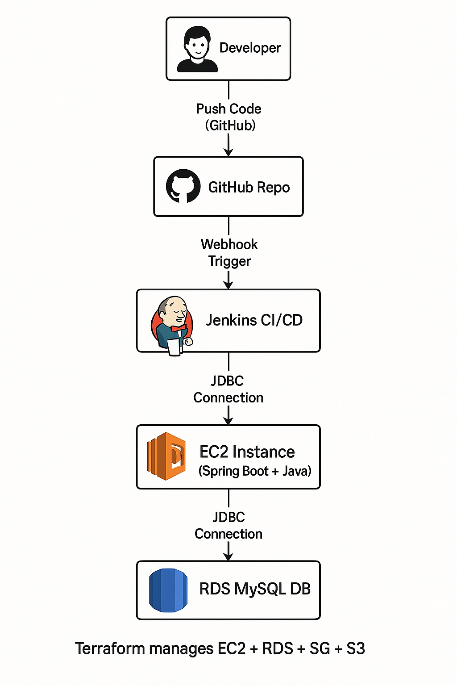
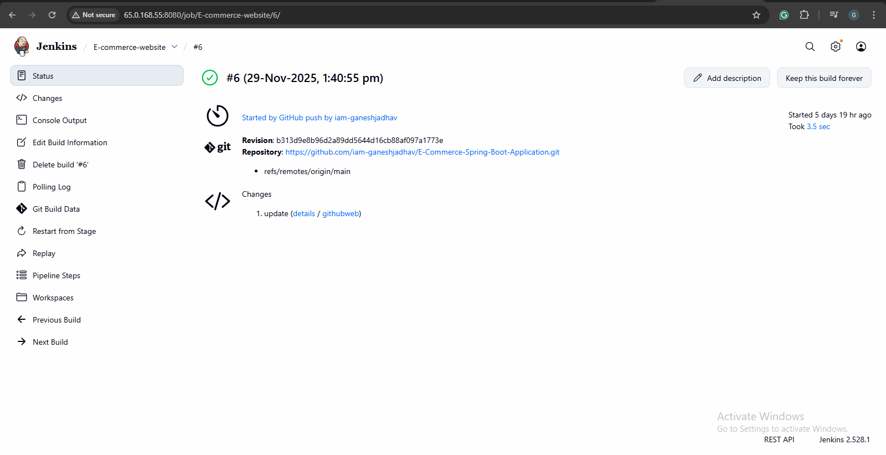
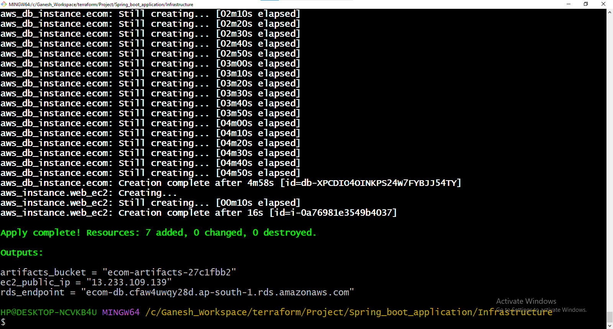
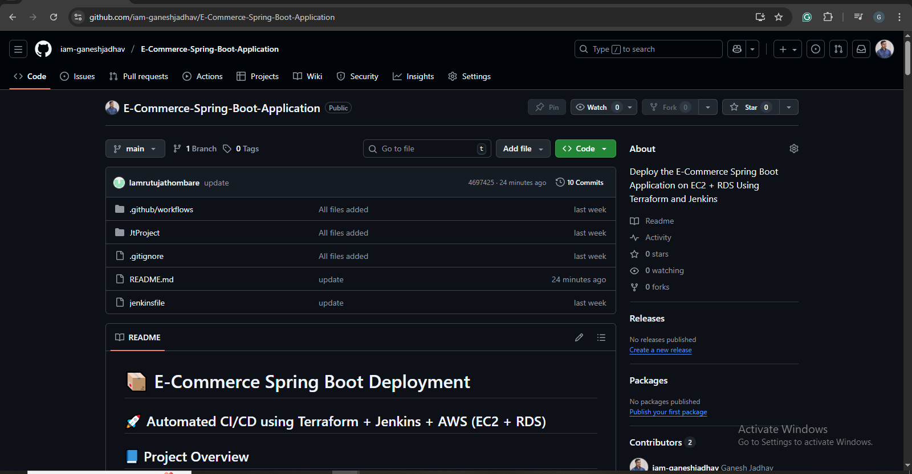

# 📦 E-Commerce Spring Boot Deployment
## 🚀 Automated CI/CD using Terraform + Jenkins + AWS (EC2 + RDS)

## 📘 Project Overview

This project showcases end-to-end automation of a Spring Boot E-Commerce Web Application deployed on AWS EC2, with RDS MySQL as the backend database.
Infrastructure is fully automated using Terraform, and application deployment is automated using Jenkins CI/CD triggered by GitHub webhooks.

The goal of this project is to demonstrate DevOps best practices, cloud automation, and real-world CI/CD pipelines.

## 🏗️ Architecture




Key Flow:
GitHub → Jenkins → EC2 → RDS

Terraform handles all AWS infrastructure provisioning.


## 🔧 Technologies Used

### Backend / Application
- Spring Boot (Java)
- Maven
- MySQL (RDS)

### Infrastructure
- Terraform
- AWS EC2
- AWS RDS (MySQL)
- AWS S3 (Optional artifacts storage)
- AWS Security Groups

### CI/CD
- Jenkins
- GitHub Webhooks
- SCP + SSH deployment
- Linux systemd service management

### System
- Ubuntu 22.04 (EC2)
- Java 17
- Git

## 📌 Project Features
- Automated provisioning using Terraform
- EC2-hosted Spring Boot application
- Managed RDS MySQL with secure access
- Systemd service for auto-restart
- Jenkins CI/CD pipeline with GitHub trigger
- Automatic JAR deployment using SCP
- Health check validation after deployment

## 🛠️ Tech Stack Summary
- Language: Java
- Build Tool: Maven
- IaC: Terraform
- Cloud: Amazon Web Services
- CI/CD: Jenkins
- OS: Ubuntu Linux

## 🔧 Project Workflow

### 1️⃣ Fork & Modify UI
- Fork repository
- Applied small UI change (title → “Ganesh Shop - E-Commerce")

### 2️⃣ Terraform Infrastructure
Terraform creates:

✔️ EC2 Instance  
- Installs Java  
- Hosts Spring Boot app  
- Runs via systemd  

✔️ RDS (MySQL)  
- Private database  
- Connected only to EC2 SG  

✔️ Security Groups  
- EC2: SSH + Port 8080  
- RDS: 3306 only from EC2  

✔️ Outputs  
- EC2 Public IP  
- RDS Endpoint  
- S3 bucket name (optional)

**main.tf**
```
terraform {
  required_providers {
    aws = {
      source  = "hashicorp/aws"
      version = "~> 5.0"
    }
  }
  required_version = ">= 1.6.0"
}

provider "aws" {
  region = "ap-south-1"
}

resource "aws_security_group" "ec2_sg" {
    name = "ec2-sg"
    vpc_id = data.aws_vpc.default.id


    ingress {
        description = "ssh"
        to_port = 22
        from_port = 22
        protocol = "tcp"
        cidr_blocks = ["0.0.0.0/0"]
    }

    ingress {
        description = "meven"
        to_port = 8080
        from_port = 8080    
        protocol = "tcp"
        cidr_blocks = ["0.0.0.0/0"]
    }

    egress {
     description = "all"
     to_port = 0
     from_port = 0
     protocol = "-1"
     cidr_blocks = ["0.0.0.0/0"]
    } 
}


resource "aws_security_group" "rds_sg" {
    name ="rds-sg"
    vpc_id = data.aws_vpc.default.id

    ingress{
        description = "mysql"
        to_port = 3306
        from_port = 3306
        protocol = "tcp"
        security_groups = [ aws_security_group.ec2_sg.id ]
        cidr_blocks = ["0.0.0.0/0"]

    } 

    egress {
        description = "all"
        to_port = 0
        from_port = 0
        protocol = "-1"
        cidr_blocks = ["0.0.0.0/0"]
    }
}


data "aws_vpc" "default" {
  default = true  
}
/*
data "aws_subnet" "default" {
    filter {
      name = "vpc-id"
      values = [ data.aws_vpc.default.id []]
    }
  
}
*/
resource "aws_instance" "web_ec2" {
    ami = var.ami
    instance_type = var.instance_type
    key_name = var.key_name
    vpc_security_group_ids = [ aws_security_group.ec2_sg.id ]
    subnet_id = var.subnet_id
 user_data = <<-EOF
    #!/bin/bash
    apt update -y
    apt install -y openjdk-17-jre git

    mkdir -p /opt/app

    cat <<EOT >/etc/systemd/system/ecommerce.service
    [Unit]
    Description=Spring Boot E-commerce
    After=network.target

    [Service]
    User=root
    WorkingDirectory=/opt/app
    ExecStart=/usr/bin/java -jar /opt/app/app.jar \\
      --spring.datasource.url=jdbc:mysql://${aws_db_instance.ecom.address}:${aws_db_instance.ecom.port}/${var.db_name} \\
      --spring.datasource.username=${var.db_username} \\
      --spring.datasource.password=${var.db_password}
    Restart=always
    RestartSec=10

    [Install]
    WantedBy=multi-user.target
    EOT

    systemctl daemon-reload
    systemctl enable ecommerce.service
  EOF
  
 tags = {
   name = "web-ec2"
 }

}

resource "aws_db_subnet_group" "ecom" {
    name = "ecom-db-subnet-group"
    subnet_ids = ["subnet-003117e7d1d556c8a","subnet-0b25a9d0dfc17274e"] 
  
}

resource "aws_db_instance" "ecom" {
  identifier           = "ecom-db"
  allocated_storage    = 20
  max_allocated_storage = 20
  db_name              = var.db_name
  engine               = "mysql"
  engine_version       = "8.0"
  instance_class       = "db.t3.micro"
  username             = var.db_username
  password             = var.db_password
  vpc_security_group_ids = [aws_security_group.ec2_sg.id]
  db_subnet_group_name = aws_db_subnet_group.ecom.name
  publicly_accessible = false
  deletion_protection = false
  skip_final_snapshot  = true
  backup_retention_period = 0
}

resource "aws_s3_bucket" "artifacts" {
    bucket = "ecom-artifacts-${random_id.bucket_id.hex }"
  
}

resource "random_id" "bucket_id" {
    byte_length = 4
  
}
```

**variables.tf**
```
variable "aws_region" {
    default = "ap-south-1"
  
}

variable "ami" {
    default = "ami-02b8269d5e85954ef"
  
}

variable "instance_type" {
    default = "t2.micro"
  
}

variable "key_name" {
    default = "jenkinsmumbai"
  
}

variable "db_username" {
    default = "root"
    
  
}

variable "db_password" {
    default = "Ganesh123"
   
  
}


variable "db_name" {
    default = "ecomdb"
  
}


variable "subnet_id" {
  default = "subnet-003117e7d1d556c8a"
}
```

**Output.tf**
```
output "ec2_public_ip" {
  value = aws_instance.web_ec2.public_ip
}

output "rds_endpoint" {
  value = aws_db_instance.ecom.address
}

output "artifacts_bucket" {
  value = aws_s3_bucket.artifacts.bucket
}
```


### ⚙️ 3️⃣ Jenkins CI/CD Pipeline
Pipeline stages:
- GitHub webhook triggers Jenkins
- Code checkout
- Maven build
- Upload JAR → EC2
- Restart systemd service
- Health check

**Jenkinsfile**
```
pipeline {
    agent any

    environment {
        GITHUB_REPO_URL = "https://github.com/iam-ganeshjadhav/E-Commerce-Spring-Boot-Application.git"
        TARGET = "ubuntu@13.232.185.76"
    }

    stages {

        stage('Checkout') {
            steps {
                git url: "${GITHUB_REPO_URL}", branch: 'main'
            }
        }

        stage('Build') {
            steps {
                sh 'cd JtProject && mvn clean package -DskipTests'
            }
        }

        stage('Deploy to EC2') {
            steps {
                sshagent(['node-key']) {
                    sh '''
                    ssh -o StrictHostKeyChecking=no $TARGET "sudo mkdir -p /opt/app"
                    rsync -avz JtProject/target/*.jar $TARGET:/opt/app/app.jar
                    ssh $TARGET "sudo systemctl restart ecommerce"
                    '''
                }
            }
        }
    }

    post {
        success {
            echo 'Pipeline succeeded!'
        }
        failure {
            echo 'Pipeline failed!'
        }
    }
}
```


## 🌐 Application Access

Browser:
```
http://<EC2_PUBLIC_IP>:8080/
```

## 📷 Screenshots

| Screenshot | Description |
|-----------|-------------|
|  | Jenkins Pipeline |
|  | Terraform Output |
|  | Github Repo |


## 🎯 What I Learned
- Terraform for AWS resource automation
- Secure cloud architecture design
- CI/CD pipeline creation using Jenkins
- RDS database configuration
- Systemd service management
- Real-world deployment process

## 👤 Author
### 👨‍💻 Ganesh Jadhav  
DevOps & Cloud Engineer  
GitHub: https://github.com/iam-ganeshjadhav  
LinkedIn: https://www.linkedin.com/in/ganesh-jadhav-30813a267/  
Gmail : jadhavg9370@gmail.com
